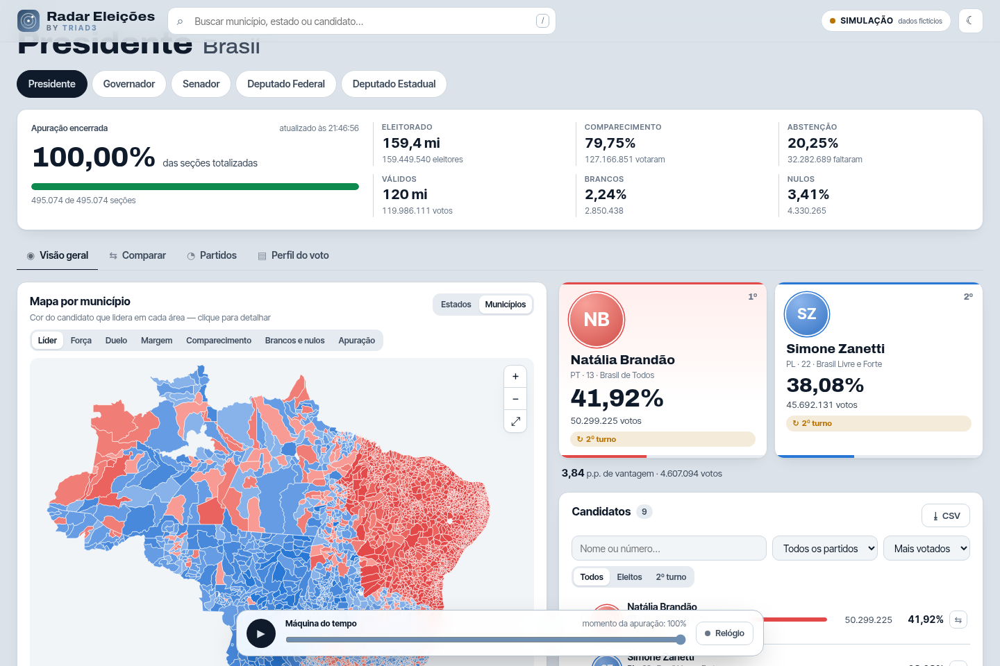
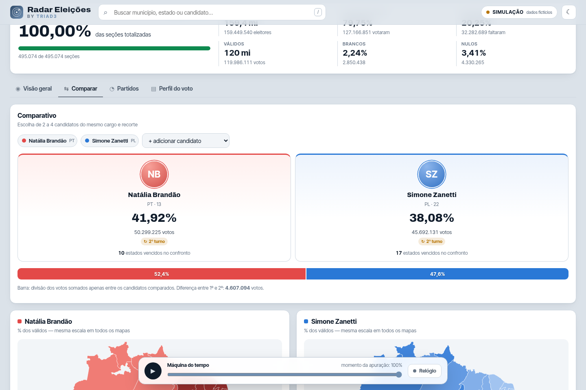
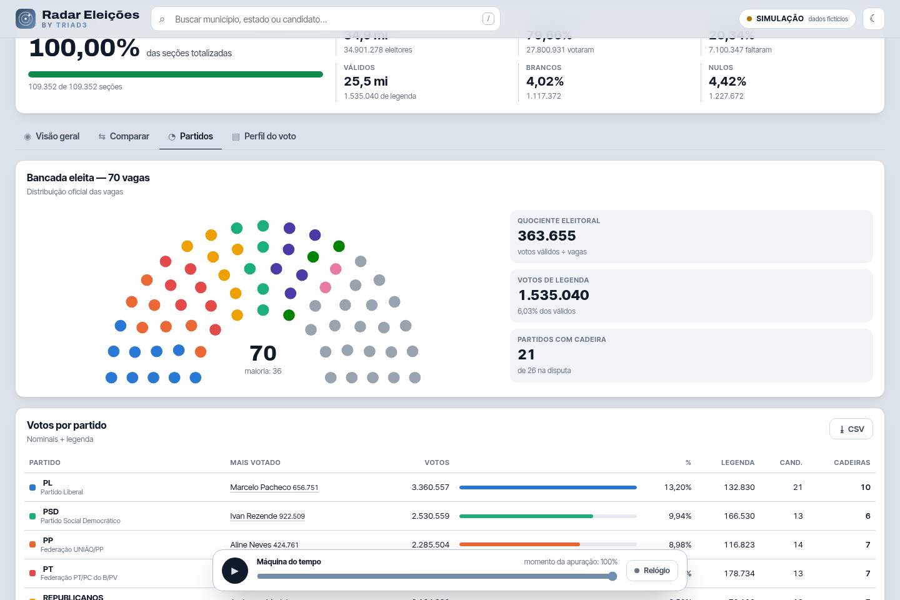
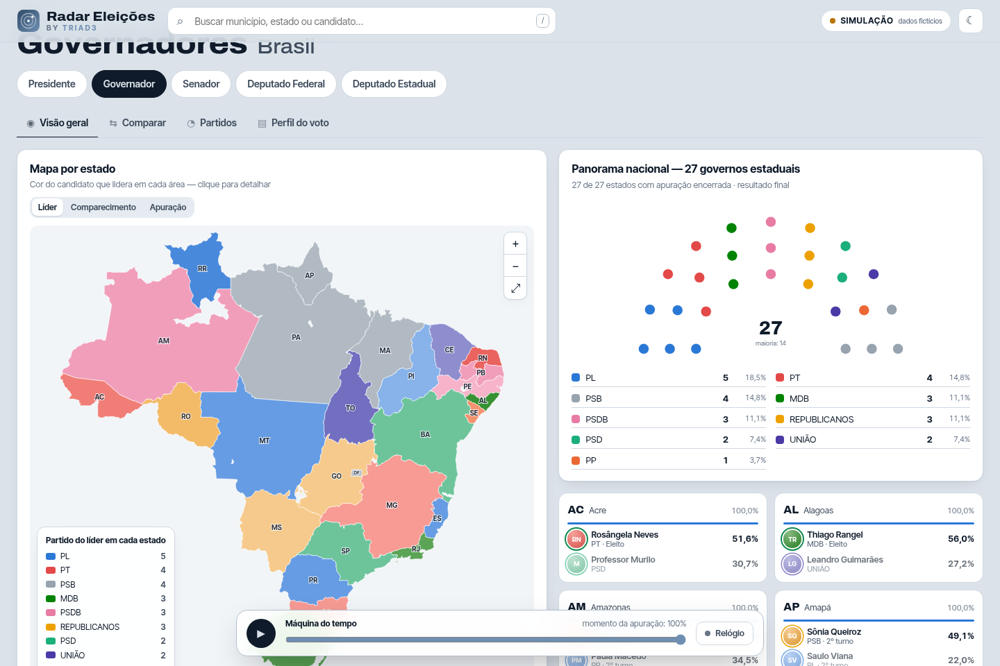

# Radar Eleições - Triad3

Central de apuração das Eleições 2026.

**O pulso do voto, do Brasil ao município.** Painel de apuração em tempo real para as Eleições Gerais de 2026: Presidente, Governadores, Senado, Câmara dos Deputados e Assembleias Legislativas, por estado e por município, com mapa interativo, fichas de candidatos, comparativos, partidos e análises do perfil do voto.



| Comparativo de candidatos | Câmara — bancada por partido | Panorama dos governadores |
|---|---|---|
|  |  |  |

> As capturas acima usam o **modo simulação** — os candidatos e números são fictícios.

## O que tem

- **Todos os cargos**: presidente, governador, senador (2 vagas), deputado federal, deputado estadual e distrital (DF).
- **Três níveis geográficos**: Brasil → estado → município, com breadcrumb, busca e links compartilháveis (o estado da tela fica na URL).
- **Mapa interativo** (zoom, arrasto, toque, dica ao passar o mouse, clique para detalhar), por estado, por município, ou **o Brasil inteiro com os 5.570 municípios**. Modos de cor:
  - **Líder** — cor do candidato/partido que lidera, com tom mais forte quanto maior a vantagem;
  - **Força** — onde o candidato escolhido vai melhor (% dos válidos);
  - **Duelo** — confronto direto entre dois candidatos (escala divergente);
  - **Margem** — onde a disputa está mais apertada;
  - **Partido** (proporcionais), **Comparecimento**, **Brancos e nulos**, **Apuração** (andamento da totalização).
- **Candidatos com foto** (fotos oficiais do TSE, com iniciais como reserva), número, partido, federação/coligação, vice ou suplentes, idade e situação (Eleito, 2º turno, Eleito por QP/média, Suplente). Filtros por nome/número, partido, situação e ordenação; exportação em CSV.
- **Ficha do candidato**: votos, posição, quantos estados/municípios lidera, onde vai melhor, onde tem mais votos e onde vai pior — com atalho para o mapa de força e para o duelo com o líder.
- **Comparar** (2 a 4 candidatos): cartões lado a lado, divisão dos votos, **mapas pequenos com a mesma escala** e tabela de confronto área por área, com vencedor de cada uma.
- **Partidos**: votos nominais e de legenda, **hemiciclo** com a bancada eleita — ou a **projeção de cadeiras** durante a apuração, calculada pelas regras brasileiras (quociente eleitoral, quociente partidário com cláusula de 10% e sobras pelas maiores médias, Lei 14.211/2021).
- **Panorama nacional** para os cargos estaduais: as 27 disputas lado a lado e a composição projetada (governos, Senado, Câmara com 513 cadeiras, Assembleias).
- **Perfil do voto**: por região, capital × interior, porte do município e dispersão tamanho × votação.
- **Evolução da apuração**: curva das porcentagens conforme as urnas são totalizadas, com as **viradas** marcadas.
- Tema claro/escuro, responsivo (celular), atalhos de teclado (`/` busca, `Esc` fecha a ficha), paleta validada para daltonismo.

## Como rodar

Requer Node.js 20+.

```bash
npm install
npm run dev        # interface em http://localhost:5173 (API em :8787)
```

Produção (um único processo serve a API e a interface):

```bash
npm run build
npm start          # http://localhost:8787
```

Testes e checagem de tipos:

```bash
npm test
npm run typecheck
```

## Hospedar na Vercel

O projeto já vem pronto para a Vercel (`vercel.json` + `npm run build:vercel`, no formato [Build Output API](https://vercel.com/docs/build-output-api/v3)):

1. Na Vercel: **Add New → Project** e importe este repositório. Não precisa mudar nada nas configurações de build — o `vercel.json` já define o comando (se o painel pedir um *Framework Preset*, use **Other**).
2. Em **Settings → Environment Variables**, defina o que quiser da tabela de variáveis abaixo (por exemplo `AGORA_MODE=live` na noite da eleição). Sem nada definido, roda em `auto`.
3. Deploy. A interface sai como arquivos estáticos e cada rota `/api/*` vira uma função Node.js.

Como fica na Vercel:

- **Região `gru1` (São Paulo)**, definida no `vercel.json` — perto do TSE e do público. Dá para trocar em *Settings → Functions*.
- **Cache de CDN**: as respostas da API saem com `s-maxage` + `stale-while-revalidate` (10 s ao vivo, 1 h para a configuração de municípios e fotos). Milhares de visitantes viram poucas execuções da função e poucas consultas ao TSE.
- **Mapa por município ao vivo**: cada consulta espera até `AGORA_MAP_WAIT_MS` (4 s) o carregamento avançar dentro da própria função; a interface vai pedindo o restante até completar.
- O cache em memória vale por instância da função; o que sustenta o tráfego é o cache da CDN.

Para conferir o pacote localmente: `npm run build:vercel` gera `.vercel/output/` (estáticos em `static/`, funções em `functions/api/*.func`).

Se preferir um servidor próprio (VPS, Docker, Render, Railway…), use `npm run build && npm start`.

## Fontes de dados e modos

O servidor tem três modos (`AGORA_MODE`):

| Modo | O que faz |
|---|---|
| `auto` (padrão) | Usa a fonte ao vivo; se ela não responder, mostra a simulação e volta sozinho para os dados reais quando a fonte voltar (testa a cada minuto). |
| `live` | Só dados ao vivo. |
| `demo` | Só a simulação, com a **máquina do tempo**: arraste (ou dê play) para reviver a noite da apuração, viradas incluídas. Candidatos e números são **fictícios**. |

### Fonte ao vivo: API Brasil Paralelo → TSE

A ordem padrão é **API Brasil Paralelo** (`https://apuracao-api.brasilparalelo.com.br`) e, em seguida, o **TSE** (`https://resultados.tse.jus.br`). Para cada arquivo, se a primeira fonte falhar, a segunda assume automaticamente.

O Radar Eleições lê os arquivos oficiais de divulgação de 2026 pela mesma árvore de caminhos `/oficial/...`:

| Arquivo | Conteúdo |
|---|---|
| `/oficial/comum/config/ele-c.jws` (EA11) | eleições, turnos, cargos e diretórios |
| `/oficial/ele2026/<eleição>/config/mun-e<eleição>-cm.jws` (EA12) | municípios (código TSE, código IBGE, capital) |
| `/oficial/ele2026/<eleição>/dados/br/br-e<eleição>-ab.jws` (EA14) | andamento por UF |
| `/oficial/ele2026/<eleição>/dados/<uf>/<uf>[<município>]-c<cargo>-e<eleição>-u.jws` (EA20) | resultados por Brasil, UF ou município |
| `/oficial/ele2026/<eleição>/fotos/<uf>/<sqcand>.jpeg` | fotos dos candidatos |

Aceita tanto **JWS assinado** (formato oficial de 2026) quanto **JSON puro**. Nos arquivos JWS, a **assinatura Ed25519 do TSE é verificada** e a interface mostra o selo "✓ assinado". Com `STRICT_SIGNATURE=1`, arquivos do TSE com assinatura inválida são recusados.

> **Sobre a API da Brasil Paralelo:** durante o desenvolvimento o host não estava acessível a partir do ambiente de build, então as rotas dela não puderam ser inspecionadas. O Radar Eleições assume que ela espelha a árvore `/oficial/...` da divulgação (o próprio painel descreve que usa os arquivos `ele-c`, EA14 e EA20). Se as rotas forem diferentes, basta ajustar a montagem do caminho em `server/tse/live.ts` (métodos `dir` e `result`) — o resto do sistema não muda. Enquanto isso, o fallback para o TSE garante os dados.

O modo ao vivo foi validado contra arquivos oficiais reais de 04/10/2026 (presidente por UF, governador, senado, deputados, distrital do DF, municípios e EA14), incluindo a verificação das assinaturas.

### Variáveis de ambiente

| Variável | Padrão | Descrição |
|---|---|---|
| `PORT` | `8787` | Porta do servidor |
| `AGORA_MODE` | `auto` | `auto`, `live` ou `demo` |
| `AGORA_SOURCES` | `bp,tse` | Ordem das fontes ao vivo |
| `BP_API_URL` | `https://apuracao-api.brasilparalelo.com.br` | Base da API Brasil Paralelo |
| `TSE_URL` | `https://resultados.tse.jus.br` | Base da divulgação do TSE |
| `AGORA_CYCLE` | `ele2026` | Ciclo eleitoral na configuração oficial |
| `AGORA_REFRESH` | `30` | Segundos entre atualizações na interface |
| `AGORA_CONCURRENCY` | `6` | Requisições simultâneas à fonte (o TSE bloqueia excesso) |
| `AGORA_MAP_WAIT_MS` | `4000` | Quanto a consulta do mapa espera a primeira carga dos municípios |
| `STRICT_SIGNATURE` | — | `1` recusa arquivos do TSE com assinatura inválida |
| `DEMO_CYCLE_MINUTES` | `18` | Duração de um ciclo completo da simulação |

Em redes com proxy corporativo, rode com `NODE_USE_ENV_PROXY=1` (Node 22.21+) para que o `fetch` do Node use `HTTPS_PROXY`.

## API do Radar Eleições

Todas as respostas são JSON normalizado (o mesmo formato para BP, TSE e simulação):

| Rota | Parâmetros | Retorna |
|---|---|---|
| `GET /api/meta` | `turno` | fonte, turnos disponíveis, cargos, avisos |
| `GET /api/resultado` | `cargo`, `uf?`, `mu?`, `turno?` | totais, candidatos, partidos, cadeiras |
| `GET /api/mapa` | `cargo`, `uf?`, `foco?`, `detalhe=mu?` | resumo de cada estado/município para o mapa |
| `GET /api/progresso` | `turno?` | andamento da apuração por UF |
| `GET /api/municipios` | — | municípios com códigos TSE/IBGE e coordenadas |
| `GET /api/foto` | `p` | foto do candidato (proxy com cache) |

`cargo` ∈ `presidente`, `governador`, `senador`, `depfederal`, `depestadual`. `mu` é o código TSE de 5 dígitos. Na simulação, `t` (0–1) posiciona a máquina do tempo.

## Arquitetura

```
server/
  api.ts             rotas /api/*, escolha de fonte e cabeçalhos de cache (CDN)
  index.ts           servidor próprio: API + arquivos estáticos (gzip)
  vercel.ts          entrada das funções serverless na Vercel
  tse/upstream.ts    cliente das fontes: cache, ETag, limite de concorrência, fallback, JWS + Ed25519
  tse/live.ts        provedor ao vivo: config oficial, eleições por cargo, carga progressiva do mapa
  tse/normalize.ts   arquivos EA20/EA14 → modelo normalizado (+ projeção de cadeiras)
  demo/demo.ts       simulação determinística de todos os cargos nos 5.570 municípios
shared/
  types.ts           modelo comum servidor ↔ interface
  seats.ts           regras de distribuição de cadeiras (QE, QP, maiores médias)
  colors.ts          cor estável por partido
  data/municipios.json  índice TSE ↔ IBGE com centróides
src/                 interface React (Vite)
  components/        mapa (d3-geo), candidatos, ficha, tabelas, hemiciclo, evolução…
  views/             Comparar, Partidos, Perfil do voto
public/geo/          malhas TopoJSON simplificadas (UFs, municípios por UF, Brasil)
scripts/build-geo.mjs  gera as malhas e o índice (npm run geo)
scripts/build-vercel.mjs  gera .vercel/output (estáticos + funções)
tests/               normalização, cadeiras, provedor ao vivo, simulação
```

## Créditos e limitações

- Malhas municipais do IBGE (via [tbrugz/geodata-br](https://github.com/tbrugz/geodata-br)); códigos TSE ↔ IBGE via [betafcc/Municipios-Brasileiros-TSE](https://github.com/betafcc/Municipios-Brasileiros-TSE) e pela configuração oficial EA12. Regenere com `npm run geo`.
- A malha é de 2010: 6 municípios criados depois aparecem na busca e nas tabelas, mas sem polígono no mapa.
- No modo ao vivo, o mapa por município é preenchido aos poucos (cada município é um arquivo na fonte), respeitando o limite de requisições do TSE.
- A simulação usa nomes e números **inventados**; qualquer semelhança com pessoas reais é coincidência.
